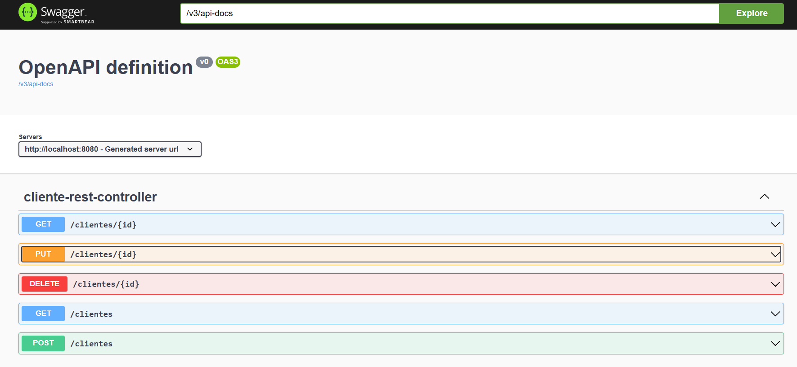

# 📂 Explorando Padrões de Projetos na Prática com Java

## 📃 Projeto desenvolvido seguindo orientações do curso de Java + Angular da plataforma DIO.

## 🚀 Tecnologias

- Java
- Swagger
- Spring Framework
  - Singleton
  - Strategy/Repository
  - Facade

 

## 💻 Projeto
> Frontend da aplicação 📸

  

http://localhost:8080/swagger-ui/index.html

Para Consumir API consultando CEP vá em _POST/clientes_

  Clique em Try it out e altere os valores para consulta

    {
      "nome": "Seunomeaqui",
      "endereco": {
        "cep": "seucepaqui"
      }
    }

---
---
## 📧 Contato
[LinkedIn](https://www.linkedin.com/in/wsawebmaster/)

wsawebmaster@yahoo.com.br
